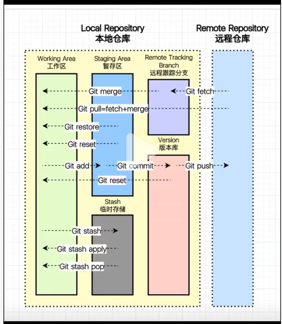

# Git指令

> 2025/11/27



## 将本地项目上传到github

```bash
# 准备一个 GitHub 仓库
# 打开 GitHub,点击右上角 New repository,创建一个空仓库，例如https://github.com/yourname/myrepo.git

# 打开 Git Bash 并进入本地项目目录 
cd /d/myproject

# 初始化 Git 仓库 
git init

# 把所有文件加入 Git 
git add .

# 提交到本地仓库
git commit -m "Initial commit"

# 绑定 GitHub 仓库
git remote add origin https://github.com/yourname/myrepo.git
# （⚠️ origin 是远程仓库名，一般用这个就行）

# 推送到 GitHub
# 若默认分支是 main
git push -u origin main
# 若默认分支是 master
git push -u origin master


# 补充
# 常见报错
fatal: remote origin already exists
# 说明你已经绑定过一次远程仓库
# 解决：解绑并重新绑定
git remote remove origin
git remote add origin https://github.com/yourname/myrepo.git
```


## 将本地文件夹上传到github

保证本地文件夹和仓库中的文件夹同名

```bash
# 本地文件夹：D:\myrepo\myfolder
# 上传后： repo/myfolder


cd /d/myrepo
git init
git add .
git commit -m "upload myfolder"
git remote add origin https://github.com/yourname/repo.git
git push -u origin main

# 补充
# 常见报错
Updates were rejected because the remote contains work that you do not have locally
# GitHub 的 main 分支 与 本地的 main 分支 两边不一致
# 解决：获取远程最新内容并自动合并，然后再推送
git pull origin main --allow-unrelated-histories
git push -u origin main

```


## 获取并修改其他人项目

 **更新别人的 GitHub 项目** ：Fork → 修改 → Push 到自己的 Fork → 发 Pull Request (PR) 

```bash
# 在 GitHub 上打开对方的项目，右上角点击 Fork , 得到https://github.com/自己用户名/原仓库名

# 把你的 Fork 克隆到本地
git clone https://github.com/自己用户名/仓库名.git

# 进入目录
cd 仓库名

# 设置新分支（name与修改关联） upstream（指向原作者的仓库）, 本地就能 pull 原作者的更新
git remote add upstream https://github.com/原作者/仓库名.git

# 查看远程：新建的upstream分支
git remote -v

# 拉取原作者的最新更新（可选）, main/master 分支
git pull upstream main

# 把更新同步到自己的 fork
git push origin main

# 在本地进行修改，比如编辑代码、修复 bug 等

# 提交更改
git add .
git commit -m "fix: xxx"

# Push 到你的 Fork（origin），此时 push 的是自己的仓库，不是对方的
git push origin main

# 发 Pull Request（PR）到原作者项目
# 去 GitHub → 自己的 Fork → 会提示
# 👉 “Compare & pull request”
# 点击以后，填写说明，提交
# 原作者会看到你的更新，可以选择合并
```

